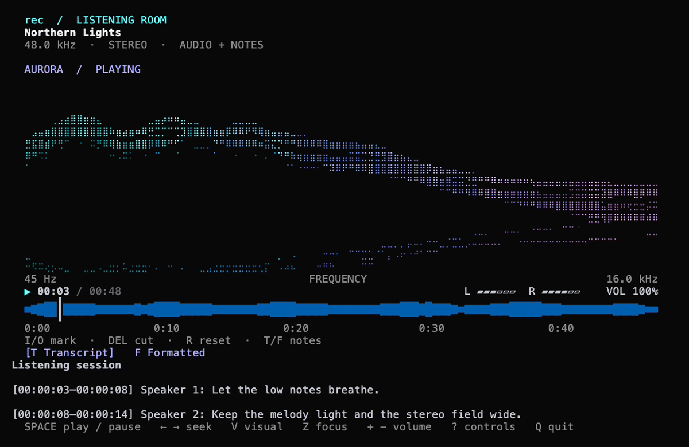
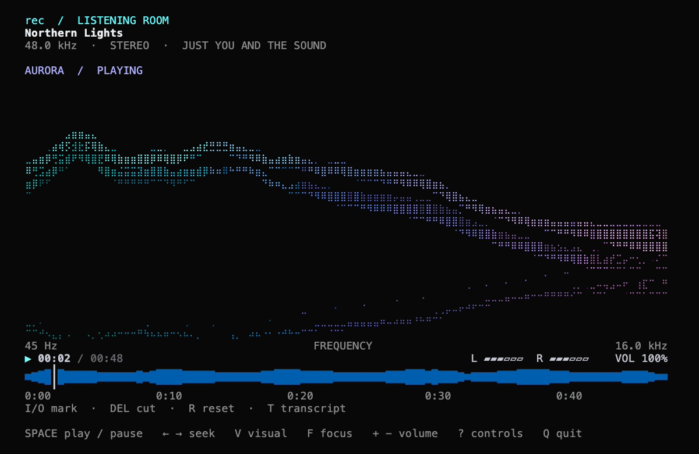

# rec

[](https://github.com/feliperun/rec/actions/workflows/ci.yml)
[](https://github.com/feliperun/rec/releases/latest)
[](https://ziglang.org)
[](LICENSE)

**Record. Transcribe. Understand.** A meeting recorder that lives entirely
in your terminal — capture microphone audio with one keypress, transcribe it
to markdown through Deepgram, and let a local coding-agent LLM clean up the
transcript or turn it into structured meeting notes. One small Zig binary,
no Electron, no servers of its own.



```
$ rec                      # records until ESC or Ctrl-C
Saved ~/recordings/20260826-093000.m4a (42:15, 38.9 MiB)

$ rec transcribe --context "sprint planning for the payments team"
Transcript saved to ~/recordings/20260826-093000.md
Refinando com Claude Code...
Transcrição refinada: ~/recordings/20260826-093000.md

$ rec format
format: processando com Claude Code...
Documento salvo em ~/recordings/20260826-093000.meeting.md
```

Both saved Markdown artifacts open immediately in the terminal viewer.

Every verb that takes a recording defaults to the latest one, so the daily
loop is `rec` → `rec transcribe` → `rec format` with nothing to look up.

## Why you might like it

- **Zero-friction capture** — `rec` alone opens the mic immediately;
  recordings land in `~/recordings/` as real M4A files on macOS (encoded by
  the OS's own AudioToolbox codec) or WAV elsewhere ([ADR 0012](docs/adr/0012-recording-format-per-platform.md)).
  `rec play`, `rec transcribe` and `rec format` act on the latest recording
  unless you name another.
- **Honest transcripts** — Deepgram nova-3 diarization rendered as clean,
  plain-prose OKF markdown: YAML frontmatter for machines, readable
  paragraphs for humans.
- **A second pass by an LLM that's already on your machine** — rec drives
  coding-agent CLIs you already have and are already authenticated with
  (Claude Code, Codex CLI, OpenCode, pi, Gemini CLI). It detects which ones
  actually *work* on your machine right now — quota, plan gates and expired
  tokens included — by running a real probe call, never by trusting
  credential files.
- **Bring your own Anthropic-compatible backend** — a Claude Code setup can
  ride **DeepSeek** or **Z.AI GLM** instead of Anthropic's own account, using
  the same `ANTHROPIC_BASE_URL`/`ANTHROPIC_AUTH_TOKEN` trick as the
  `claudeseek`/`claudezai` shell functions. Your API key is never stored —
  rec reads it from the environment at call time.
- **Templates you own** — meeting notes come from an editable prompt file in
  `~/.config/rec/templates/meeting.md`. Change it, rewrite it, add your own
  templates (`retro`, `standup`, whatever) and run them with `--template`.
- **Nothing is silently lost** — refinement failing never damages the raw
  transcript; the artifact is always on disk before any LLM touches it.

## Install

macOS and Linux:

```sh
curl -fsSL https://raw.githubusercontent.com/feliperun/rec/main/install.sh | sh
```

Windows (PowerShell):

```powershell
irm https://raw.githubusercontent.com/feliperun/rec/main/install.ps1 | iex
```

Each installer detects OS and architecture, downloads the matching release
build, and installs it: `/usr/local/bin/rec` on macOS and Linux, and
`%LOCALAPPDATA%\Programs\rec\rec.exe` (added to your PATH) on Windows.
Pass `VERSION=<tag>` to pin a release instead of the latest.
No dependencies beyond the OS.

For transcript processing, install at least one supported coding agent and
authenticate it the way you normally would, then run `rec setup`.

**Provider prerequisites** — if you want Claude Code to run on DeepSeek or
Z.AI GLM (the `claudeseek`/`claudezai` trick), export the matching key before
running rec; `rec setup` refuses the provider until it's present:

```sh
export DEEPSEEK_API_KEY=sk-...   # DeepSeek provider
export ZAI_API_KEY=sk-...        # Z.AI GLM provider
```

Provider keys are never written to disk: rec only reads them from the
environment at the moment a call happens.

## First run

```sh
rec setup    # Deepgram key + pick which coding-agent LLM processes transcripts
```

`rec setup` first asks for your Deepgram API key (transcription) and stores
it at `~/.config/rec/deepgram_key` — skip it if `DEEPGRAM_API_KEY` is
already exported; the environment always wins over the stored key. It then
probes every installed harness with a genuine test call, shows only the
usable ones, lists their available models where the harness can tell us,
validates your exact harness+model pick once more, and saves it to
`~/.config/rec/config.json`. Run it again any time to switch.

## Usage

### record

```sh
rec [--duration <sec>]          # the default verb
rec record [--duration <sec>]   # the same, spelled out
```

Records from the default microphone to `~/recordings/YYYYMMDD-HHMMSS.m4a`
(AAC-LC, 48 kHz, stereo, via AudioToolbox); `~/recordings/` is created on
demand. Without `--duration`, recording stops on Ctrl-C or `ESC`; with
`--duration <sec>` it stops automatically. On a terminal, a live view opens on
the alternate screen: a ticking timer and the sound as it happens, scrolling
in from the right edge like a seismograph over a time ruler that moves with
it. The waveform is a mirrored scope drawn at eighth-of-a-row resolution:
the RMS energy glows as a bright core inside the dimmer peak envelope, and
the rows climb a VU ramp — speech stays blue and cyan, only loud audio
reaches the yellow and red rows. The grid takes as many rows as your
terminal affords (4 to 12). `SPACE` pauses and resumes; paused audio is
dropped, so the file keeps only what you meant to record. Your scrollback
stays clean and resizing the window mid-recording never scrambles the
display. The container is always finalized — a failed encode leaves no
partial file behind.

When an interactive recording is stopped with `ESC` or `Ctrl-C`, the new take
opens immediately in playback so it can be checked before the next command.

Recordings of at least 10 seconds warn after saving if the audio stayed very
quiet (below −40 dBFS RMS in every measured window). The file is preserved.
Check the selected input and its volume, then listen to a short test recording
before starting a longer session. This level check does not detect speech.

| Key | Action |
|-----|--------|
| `SPACE` | Pause / resume (paused audio is discarded) |
| `ESC` / `Ctrl-C` | Stop and save |

### list

```sh
rec list
```

Prints the recordings in `~/recordings/` (newest first) with index,
filename, duration parsed from the recording's container, and file size.
Both `.m4a` and pre-existing `.wav` recordings are listed.

### play

```sh
rec play [index|filename]
```

Plays a recording through the default output device, in-process: the file is
decoded once and the same PCM feeds the waveform and the speaker. The
selection can be an index from `list` or a filename (with or without the
`recordings/` prefix); with none, the latest recording plays.

On a terminal, playback opens a **listening room**. Aurora draws luminous trails
from the audio's frequency bands; `V` switches to a peak-holding spectrum or a
stereo oscilloscope. `Z` expands the visual into focus mode. The animation follows
the actual audio and freezes when paused. The player uses Unicode and 256 colors,
works in Terminal.app, and respects `NO_COLOR`.



The whole recording remains visible as a colored waveform with a time ruler and
playhead. Marking a region turns it magenta between the cut anchors. When a
transcript (`NAME.md`) exists, it appears below the audio. Transcript and formatted
notes (`NAME.meeting.md`) are tabs on the same scrollable page. `T` and `F` select
them; `Home` returns to the audio. Small windows use a compact
layout. `?` shows the controls.

Try an original synthetic ambient loop in a temporary library after building:

```sh
zig build -Doptimize=ReleaseSafe
python3 scripts/demo_player.py
```

Keys:

| Key | Action |
|-----|--------|
| `SPACE` | Pause / resume; replay when the recording ends |
| `V` | Cycle Aurora → Spectrum → Scope |
| `Z` | Toggle focus mode |
| `?` | Show / hide controls |
| `+` / `-` / `M` | Adjust playback volume / toggle mute |
| `0`–`9` | Seek to 0–90% of the recording |
| `←` / `→` | Seek 1 second back / forward |
| `SHIFT`+`←` / `SHIFT`+`→` | Seek 5 seconds back / forward |
| `I` / `O` | Anchor the start / end of the region to cut |
| `DELETE` | Ask to remove the anchored region — `ENTER` confirms |
| `T` | Select the transcript; generate it when absent |
| `F` | Select formatted notes; generate them when absent |
| `Tab` | Switch tabs without starting generation |
| `Y` | Copy the active tab’s Markdown to the clipboard |
| `S` | Share the active tab’s Markdown to the clipboard |
| `C` / `L` / `G` | Open it in ChatGPT / Claude / Gemini |
| `↑` / `↓` / mouse wheel / `PgUp` / `PgDn` | Scroll audio and the selected document |
| `Home` / `End` | Jump to the waveform / end of the document |
| `R` | Clear the anchors |
| `Q` / `Ctrl-C` | Stop playback |

Transcription and formatting run in the background without closing the waveform
or interrupting playback. F uses the `meeting` template and first transcribes
when needed. Existing documents open immediately; repeated keys do not duplicate
jobs. Failures stay in the selected tab; press T or F to retry. Q cancels any
pending job. Copy/share uses the complete saved Markdown of the active tab;
frontmatter is hidden in the playback reading view.

Cutting removes the piece between the anchors (head, tail, or middle) after
`ENTER` confirms the prompt, replaces the original file, and keeps the player
open after the shortened audio is reloaded. The transcript (`NAME.md`) is left
untouched. Cutting waits until text generation finishes.

Off a terminal (piped output), playback runs to completion; `Ctrl-C` stops it.

The Markdown viewer wraps to the terminal width, stays still while idle, and
supports `↑`/`↓`, `PgUp`/`PgDn`, `Home`, and `End` so the complete document is
readable. Playback stays open at EOF; SPACE replays it. T and F switch documents
with the waveform at the top; Home returns there after scrolling.

Use `rec view path.md` to reopen a saved transcript or formatted document.

### transcribe

```sh
rec transcribe [index|filename] [--language <code>] [--out <path>]
               [--no-refine] [--context <text>]
```

Transcribes a recording through Deepgram's pre-recorded API and saves an
[Open Knowledge Format](https://cloud.google.com/blog/products/data-analytics/how-the-open-knowledge-format-can-improve-data-sharing)
markdown file next to the recording (`NAME.m4a` → `NAME.md`; M4A goes over
the wire as `audio/mp4`, legacy WAV as `audio/wav`). The selection resolves
exactly like `play`, the latest recording included. The spoken language is detected automatically and saved in
the transcript metadata. `--language <code>` forces a language (for example,
`pt-BR` or `en`); `--language auto` restores detection. A mismatched language can
produce an empty transcript even when the recording contains clear speech.
`--out` writes elsewhere.

Each speaker turn keeps its Deepgram timing in the body, for example
`[00:01:12–00:01:16] Speaker 1: ...`, so `rec format` can use it.

Then, by default, **the refine pass runs**: the transcript travels through
your configured LLM together with the bundled *refine* prompt, which fixes
hard-to-hear words that ASR got wrong and rewrites the same `.md`, keeping
its frontmatter.

- `--context "<text>"` gives the model domain context — project names, team
  jargon, attendee names — dramatically improving fixes.
- `--no-refine` keeps just the raw transcript.
- Any LLM failure prints a one-line notice and exits 0 with the raw
  transcript untouched.

### format

```sh
rec format [index|filename|path] [--template meeting] [--out <path>] [--context <text>]
```

Turns an existing transcript into a structured document with a prompt
template — the latest recording's transcript when no selection is given.
Without `--out`, the result lands beside the source named after the
template:

```
~/recordings/planning.m4a → planning.md → planning.meeting.md
```

The bundled **meeting** template produces speaker tables, an executive
summary, decisions, and action items from a raw transcript. Templates are
plain markdown prompts under `~/.config/rec/templates/` — `meeting.md` and
`refine.md` are copied there on first use so you can edit them freely;
upgrades never overwrite your edits. Add a `retro.md` and it instantly
becomes `rec format 1 --template retro`. Unknown names list what's
available; a read-only config dir falls back to the embedded copies.

The formatted document opens in the Markdown viewer after it is saved. Press
`y` to copy its original Markdown, `s` to share to the clipboard, or `c`, `l`,
and `g` to open ChatGPT, Claude, and Gemini.

### share

```sh
rec share [index|path] [--to clipboard|chatgpt|claude|gemini]
```

Shares a transcript or any Markdown path. The default destination is the
clipboard; the other destinations copy the full Markdown and open the chosen
website. Paste into its composer. This also works with long documents without
URL length limits; it does not automatically submit a prompt.

### setup

```sh
rec setup        # alias: rec configure-llm
```

Chooses which coding-agent CLI processes transcripts. Supported today:
Claude Code, Codex CLI, OpenCode, pi, Gemini CLI. When you pick Claude Code,
rec also asks which **provider** backs it:

- **Anthropic** — Claude's own account (default);
- **DeepSeek** — needs `DEEPSEEK_API_KEY` exported;
- **Z.AI GLM** — needs `ZAI_API_KEY` exported.

The choice is validated with a real call before it's saved to
`~/.config/rec/config.json`; re-run `rec setup` anytime to switch. See
[First run](#first-run) for the provider prerequisites.

### about

```sh
rec about
```

Prints the version and the project page — bug reports, ideas, and pull
requests are welcome.

### update

```sh
rec update
```

Checks GitHub Releases for a newer build and replaces the running binary
with this platform's asset; the new version takes effect on the next
invocation. rec also checks on its own, silently, at most once a day before
running any other command, and only speaks up when it updated itself — no
network, no noise ([ADR 0014](docs/adr/0014-self-update-from-github-releases.md)).

### help

```sh
rec help        # also: rec --help, rec -h
```

### Colors

The live views (record, play) and the `list` table are colored on a
terminal: the waveform rows climb a VU ramp from the midline outward (blue →
cyan → green → yellow → red) with the RMS core brighter than the peak halo,
the playback waveform stays colored at every position, a marked region is
magenta, the playhead is a line in your terminal's default color, the ⏺
recording dot is red, the ▶/⏸
playback state is green/yellow, and secondary text is dimmed. Piped output
carries no ANSI codes, so scripts can keep grepping it; set `NO_COLOR` to
opt out on a terminal too (the waveform shape, the ruler and the playhead
stay; color is removed from the waveform).

## Build from source

Prerequisites:

- A supported platform with a working microphone (macOS Apple Silicon/Intel,
  Linux x64/arm64, Windows x64)
- [Zig](https://ziglang.org) 0.16: `brew install zig` or from ziglang.org

```sh
zig build
zig build test     # unit tests: encoder, parsers, prompts, arg parsing
```

The binary lands at `zig-out/bin/rec`. Any host cross-compiles any target —
`zig build -Dtarget=x86_64-windows` (or `-Dtarget=x86_64-macos`,
`aarch64-linux`, …) builds it without a toolchain for that platform. Audio
I/O (capture and playback) uses the vendored
[miniaudio](https://miniaud.io) library; releases are built in `ReleaseFast`
mode (see `.github/workflows/release.yml`).

## How it works

- **Capture** — `src/capture.zig` drives miniaudio's default input device,
  appending PCM frames to a growable buffer until stopped.
- **M4A** — `src/m4a.zig` encodes captured PCM into an M4A/AAC container
  through AudioToolbox's system encoder and reads durations back out via the
  system MP4 parser.
- **Library** — `src/library.zig` scans `~/recordings/` (M4A + legacy WAV),
  sorts newest-first, and formats what `list` prints; numeric selections are
  always relative to this order across every command.
- **Playback** — `src/player.zig` plays the decoded PCM on miniaudio's
  default output device with an atomic playhead (seek is a store, pause a
  gate); `src/playback.zig` is the interactive view and key loop over it.
- **Transcription** — `src/transcribe.zig` shells out to `/usr/bin/curl` for
  Deepgram's pre-recorded API; `src/okf.zig` renders the markdown bundle.
- **LLM processing** — `src/llm.zig` drives coding-agent CLIs
  non-interactively: the composed prompt streams into the child's stdin
  through a single-thread poll loop (nonblocking feed + deadline), answers
  come back per-harness (Claude/pi/OpenCode stdout, codex `-o` tmpfile,
  gemini JSON envelope). For non-Anthropic providers the child gets an
  environment overlay — `ANTHROPIC_BASE_URL`, `ANTHROPIC_AUTH_TOKEN` (read
  live from `DEEPSEEK_API_KEY`/`ZAI_API_KEY`), and the provider's default
  models — mirroring `claudeseek`/`claudezai` exactly. Config and user
  templates live under `~/.config/rec/`; `src/setupcmd.zig` and
  `src/formatcmd.zig` implement `setup` and `format`.
- **Prompts** — `src/prompts.zig` embeds the bundled templates verbatim in
  the binary; composition fills `{{DOMAIN_CONTEXT}}` and delimits the
  transcript payload.
- **Keys** — `src/keys.zig` owns raw mode for the live views and restores
  the cooked terminal on any exit path.

See [`docs/SPEC.md`](docs/SPEC.md) for the functional specification.

## Notes

- Recordings live outside the repository under `~/recordings/`; build
  outputs stay git-ignored.
- Transcription quality follows Deepgram; refinement quality follows
  whichever coding agent you point rec at. Both degrade independently and
  gracefully.
- Supported platforms: macOS Apple Silicon and Intel, Linux x64/arm64
  (recording as WAV), and Windows x64 (WAV). M4A recording stays macOS-only —
  it uses the OS's own AAC codec.

## License

[MIT](LICENSE)
